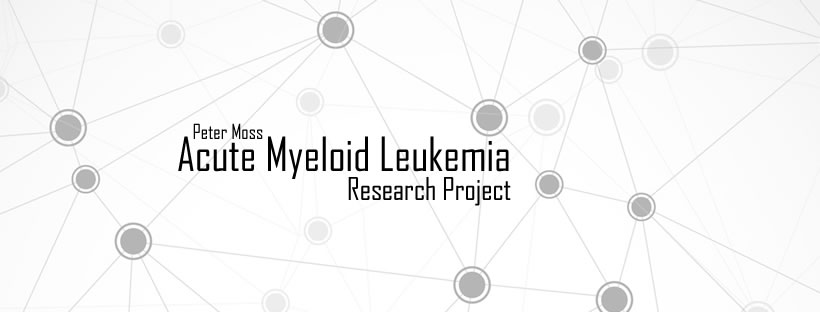

# Acute Myeloid Leukemia Research Project

 

Documenting project research and data for the Peter Moss Acute Myeloid Leukemia Research Project. 

# Project Research & Data

- Papers on [Convolutional Nueral Networks for Acute Myeloid Leukemia](https://github.com/AMLResearchProject/Research/Papers/CNN-AML-Papers.md "Convolutional Nueral Networks for Acute Myeloid Leukemia"). [List of papers](https://www.zotero.org/groups/2241402/acute_myeloid_leukemia "List of papers") provided by Ho Leung Ng, Kansas State University, Dept. Biochemistry & Molecular Biophysics.

- [Acute Lymphoblastic Leukemia Image Database for Image Processing](https://homes.di.unimi.it/scotti/all/ "Acute Lymphoblastic Leukemia Image Database for Image Processing") provided by Fabio Scotti, Associate Professor Dipartimento di Informatica @ Università degli Studi di Milano.
